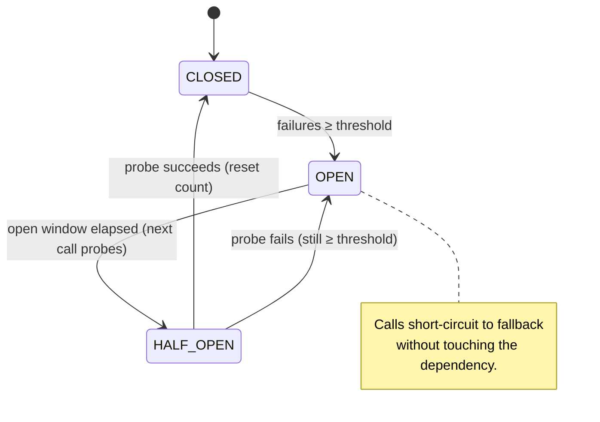
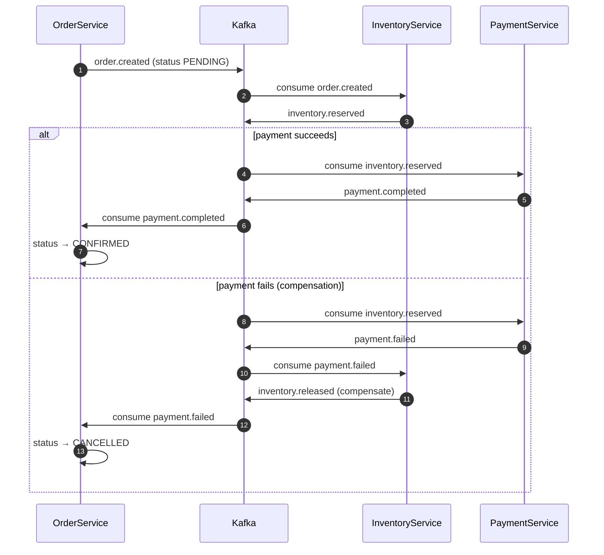
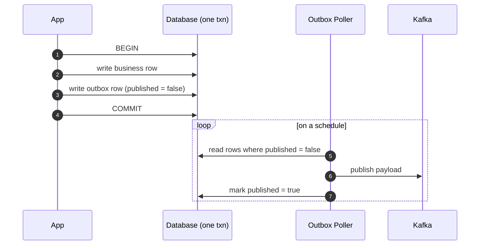
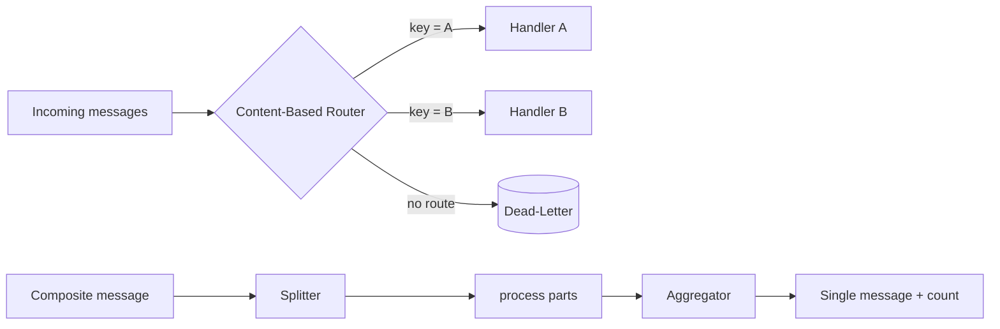
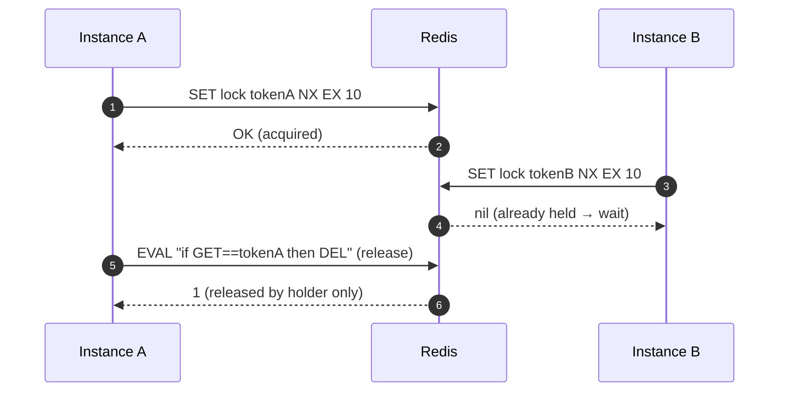

# Distributed-Systems Patterns

Diagram-first explanations of the resilience, messaging, coordination, and integration
patterns implemented in this repo. Each section ends with a **See it in code** backlink to
the real (and tested) implementation.

> Diagrams use [Mermaid](https://mermaid.js.org/) and render natively on GitHub. In an IDE,
> install a Mermaid preview plugin to see them.

---

## Circuit Breaker

Stops a caller from hammering a failing dependency. While **CLOSED**, calls pass through and
consecutive failures are counted. When failures reach the threshold the breaker trips to
**OPEN** and short-circuits straight to a fallback. After the open window elapses, the next
call probes in **HALF_OPEN**: a success closes the breaker (and resets the count); a failure
trips it open again.

*Tradeoff:* a threshold set too low trips on transient blips; too high delays protection and
lets failures cascade. *Production:* [Resilience4j](https://resilience4j.readme.io/) circuit breaker.

**See it in code:** [`CircuitBreaker`](../spring-boot/src/main/java/com/denjossal/study/springboot/resilience/CircuitBreaker.java)
(this state machine is also the GoF **State** pattern — see [GoF patterns](./gof-design-patterns.md#state)).

---

## Saga (with compensation)

A business transaction spanning services, coordinated by events instead of a distributed lock
or two-phase commit. Each local step publishes an event that triggers the next. If a step
fails, previously completed steps are undone by **compensating transactions** (release stock,
cancel order) rather than rolled back.

*Tradeoff:* no global lock, so the system is eventually consistent and every step must be
idempotent and have a compensator. *Production:* orchestration (e.g. a workflow engine) or
choreography over Kafka.

**See it in code:** [`SagaPatternTest`](../integration-tests/src/test/java/com/denjossal/study/integration/saga/SagaPatternTest.java)
— proves both the happy path and the payment-failure compensation against real Kafka + PostgreSQL.

---

## Transactional Outbox + Poller

A DB write and a broker publish are not atomic: publish-first risks an event for data that
never saved; DB-first risks a lost event. The outbox writes the business row **and** an outbox
row in the **same transaction**; a separate poller later publishes unpublished rows and marks
them done.

*Tradeoff:* gives **at-least-once** delivery (consumers must dedupe) and adds **polling
latency**. *Production:* swap the poller for CDC ([Debezium](https://debezium.io/)).

**See it in code:** [`OutboxPattern`](../spring-boot/src/main/java/com/denjossal/study/springboot/messaging/OutboxPattern.java)
(in-memory mechanics) and [`OutboxPollerTest`](../integration-tests/src/test/java/com/denjossal/study/integration/distributed/OutboxPollerTest.java)
(real Postgres + Kafka).

---

## Enterprise Integration Patterns

The Hohpe & Woolf vocabulary that Apache Camel routes are built from, modeled as pure
functions over a `Message(headers, body)`. The mental model is `From → Process → To`.

*Tradeoffs:* the **Claim Check** trades message size for an external-store lookup (and a
dangling-claim failure mode); the **Wire Tap** adds observability at the cost of a duplicated
message.

**See it in code:** [`EnterpriseIntegrationPatterns`](../spring-boot/src/main/java/com/denjossal/study/springboot/integration/EnterpriseIntegrationPatterns.java)
— Content-Based Router (with dead-letter fallback), Splitter, Aggregator, Wire Tap, Claim Check.

---

## Distributed Lock (Redis)

Mutual exclusion across instances with one atomic Redis command. `SET key token NX EX ttl`:
`NX` makes acquire atomic (only if absent), `EX` auto-expires so a crashed holder can't
deadlock, and a unique token plus a **Lua check-and-delete** ensures only the holder releases
(closing the GET-then-DEL race).

*Tradeoff:* the TTL must outlast the critical section or the lock can expire mid-work; clock
drift across nodes is why production reaches for Redlock/[Redisson](https://redisson.org/).

**See it in code:** [`DistributedLockTest`](../integration-tests/src/test/java/com/denjossal/study/integration/distributed/DistributedLockTest.java)
— includes a 10-thread × 50-increment concurrency proof.

---

## Further reading

- [Azure Cloud Design Patterns](https://learn.microsoft.com/azure/architecture/patterns/) — Circuit Breaker, Bulkhead, Transactional Outbox, CQRS, Saga, and more.
- [microservices.io patterns](https://microservices.io/patterns/) (Chris Richardson) — Saga, Transactional Outbox, CQRS.
- [Resilience4j documentation](https://resilience4j.readme.io/) — production circuit breaker / bulkhead / retry.
- [Enterprise Integration Patterns](https://www.enterpriseintegrationpatterns.com/) — Hohpe & Woolf, the EIP catalog.
- Martin Fowler — [CircuitBreaker](https://martinfowler.com/bliki/CircuitBreaker.html), [CQRS](https://martinfowler.com/bliki/CQRS.html), [Event Sourcing](https://martinfowler.com/eaaDev/EventSourcing.html).
- [Redis distributed locks (Redlock)](https://redis.io/docs/latest/develop/use/patterns/distributed-locks/).
