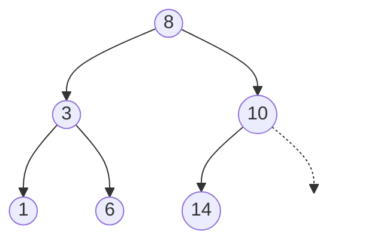
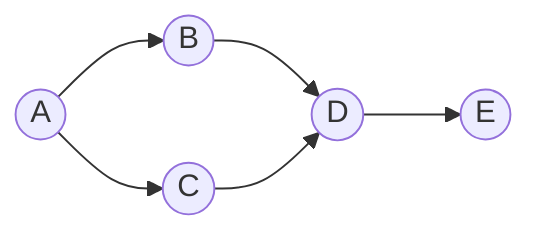
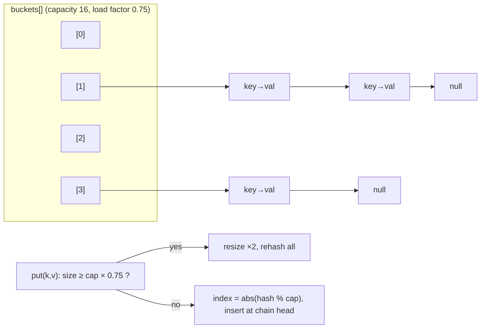
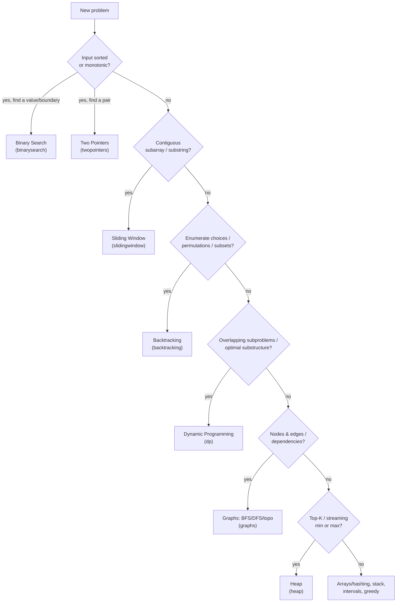

# Data Structures & Algorithms

Visual companions to the from-scratch data structures in [`dsa`](../dsa) and the
pattern-based solutions in [`algorithms`](../algorithms). Each section links back to the real
implementation.

> Diagrams use [Mermaid](https://mermaid.js.org/) and render natively on GitHub.

---

## Binary Search Tree — in-order traversal yields sorted output

A BST keeps the invariant *left subtree < node < right subtree*. The payoff: an **in-order**
traversal (left → node → right) visits keys in ascending order, and `contains` is O(log n) on
a balanced tree (O(n) if it degenerates into a list).

In-order of the tree above: `1, 3, 6, 8, 10, 14`.

**See it in code:** [`BinarySearchTree`](../dsa/src/main/java/com/denjossal/study/dsa/tree/BinarySearchTree.java)
(in/pre/post/level-order traversals, `insert`/`contains`/`delete`).

---

## Graph traversal — BFS vs DFS

Same graph, two visit orders. **BFS** uses a queue and explores level by level (and so finds
the shortest unweighted path). **DFS** uses recursion/a stack and dives down one branch before
backtracking. Both are O(V + E) on an adjacency list.

- **BFS from A:** `A, B, C, D, E` (queue: visit A's neighbors before going deeper).
- **DFS from A:** `A, B, D, E, C` (dive A→B→D→E, backtrack, then C).

**See it in code:** [`Graph<T>`](../dsa/src/main/java/com/denjossal/study/dsa/graph/Graph.java)
(`bfs`, `dfs`, `shortestPath`, `hasCycle`, `topologicalSort`, `connectedComponents`);
union-find lives in [`UnionFind`](../dsa/src/main/java/com/denjossal/study/dsa/graph/UnionFind.java).

---

## HashMap — separate chaining + resize

Keys hash to a bucket index (`abs(hashCode % capacity)`). Collisions are handled by a linked
**chain** per bucket (new entries inserted at the head). When `size ≥ capacity × 0.75` the
table **doubles** and every entry is rehashed — keeping average operations O(1) (worst case
O(n) if everything collides into one chain).

**See it in code:** [`HashMap`](../dsa/src/main/java/com/denjossal/study/dsa/hashtable/HashMap.java)
(`put`/`get`/`remove`/`containsKey`, 0.75 load factor, ×2 resize). The array-backed heap is in
[`MinHeap`](../dsa/src/main/java/com/denjossal/study/dsa/heap/MinHeap.java).

---

## Choosing an algorithm pattern

The hard part of `algorithms` problems is recognizing *which* pattern applies. This decision
tree maps a problem's shape to the pattern (and the package) that solves it.

*Rule of thumb (from [`ComplexityExamples`](../dsa/src/main/java/com/denjossal/study/dsa/complexity/ComplexityExamples.java)):*
work backward from the constraints — `n ≤ 20` hints at exponential/backtracking, `n ≤ 10^5`
hints at O(n log n), `n ≤ 10^9` hints at O(log n) or O(1).

**See it in code:** the 13 pattern packages under [`algorithms`](../algorithms) and the
constraint → complexity cheat sheet in
[`ComplexityExamples`](../dsa/src/main/java/com/denjossal/study/dsa/complexity/ComplexityExamples.java).

---

## Further reading

- [VisuAlgo](https://visualgo.net/) — animated visualizations of data structures and algorithms.
- [NeetCode roadmap](https://neetcode.io/roadmap) — the pattern-based LeetCode path this module mirrors.
- [Big-O cheat sheet](https://www.bigocheatsheet.com/) — complexity of common operations at a glance.
- *Introduction to Algorithms* (CLRS) — the canonical reference text.
- [GeeksforGeeks — Data Structures](https://www.geeksforgeeks.org/data-structures/) — per-structure explanations.
