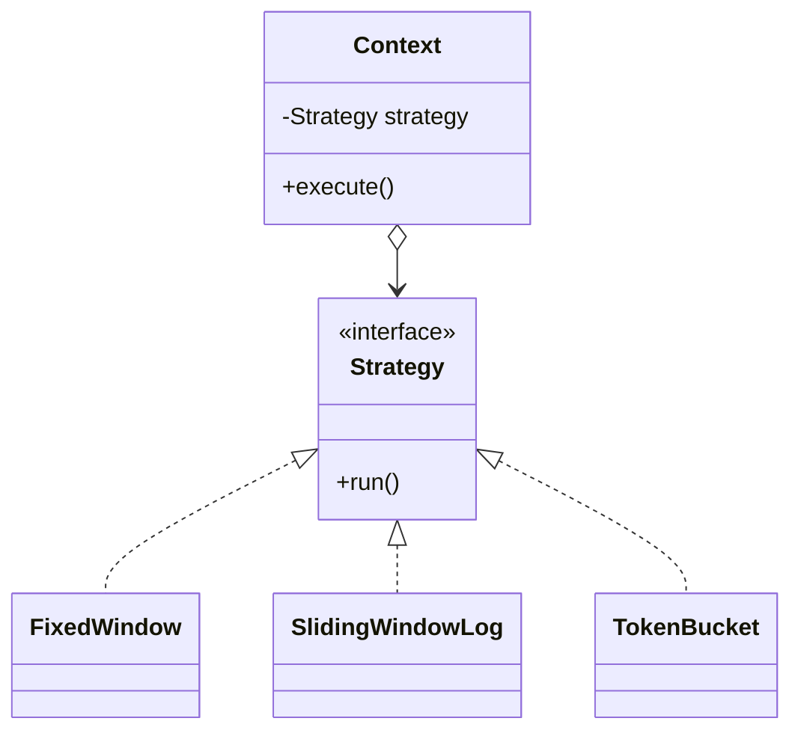
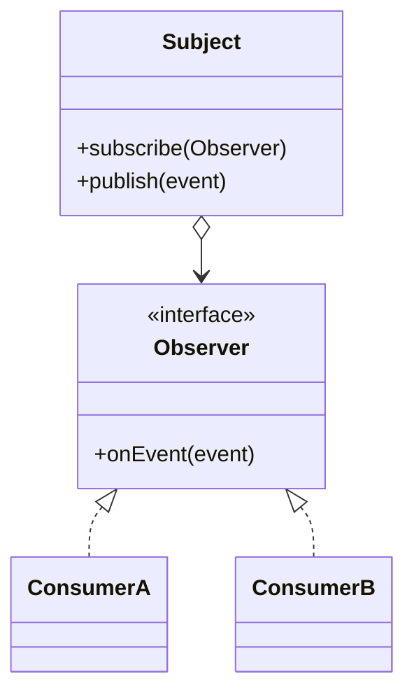
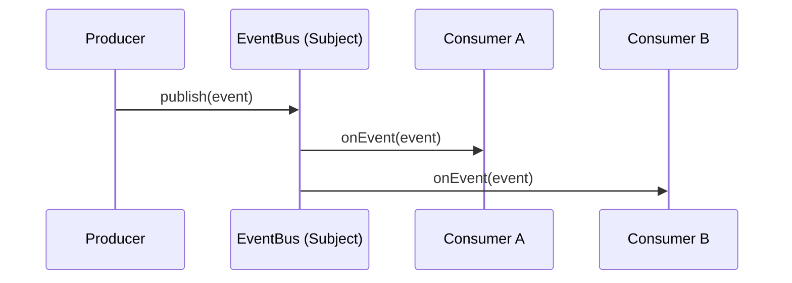
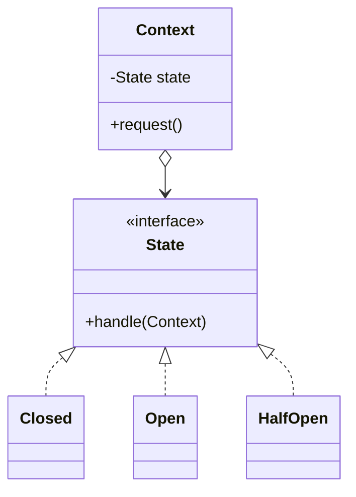
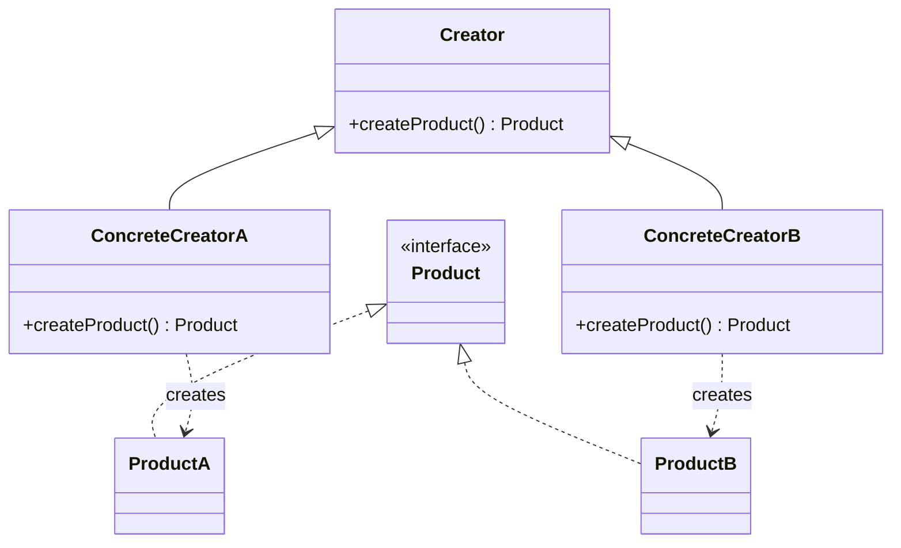
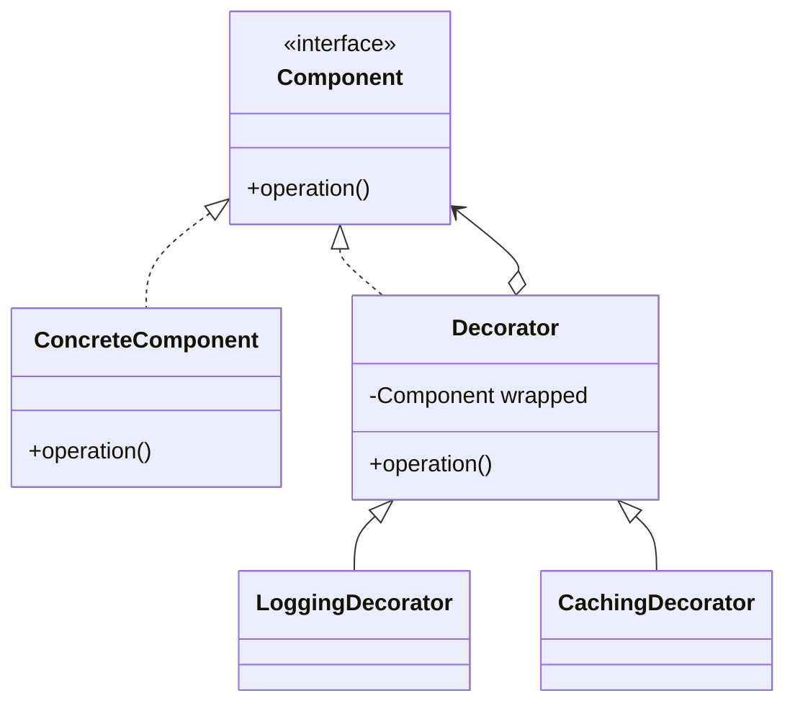

# GoF Design Patterns

The classic *Gang of Four* patterns, with structure diagrams. These are general OO patterns
(no dedicated module in this repo), but several of them already show up in the repo's code —
those cross-links are called out so you can see the pattern in a real implementation, not just
a UML sketch.

> Diagrams use [Mermaid](https://mermaid.js.org/) `classDiagram` and render natively on GitHub.

---

## Strategy (behavioral)

Define a family of interchangeable algorithms behind one interface; the context picks which to
use at runtime. Swapping behavior becomes a swap of object, not a branch in the caller.

**In this repo:** the three rate-limiting algorithms — fixed window, sliding-window log, and
token bucket — are concrete strategies sharing one "allow this request?" decision.
See [`RateLimiterTest`](../integration-tests/src/test/java/com/denjossal/study/integration/distributed/RateLimiterTest.java).

---

## Observer (behavioral)

A subject maintains a list of observers and notifies them on state change, without knowing who
they are. This is the shape of any publish/subscribe system.

**In this repo:** [`InMemoryEventBus`](../spring-boot/src/main/java/com/denjossal/study/springboot/messaging/InMemoryEventBus.java)
is an Observer/pub-sub bus (unroutable or failing events go to a dead-letter queue).

---

## State (behavioral)

An object alters its behavior when its internal state changes — it appears to change class.
Each state encapsulates the transitions out of it, replacing a sprawl of conditionals.

**In this repo:** the [`CircuitBreaker`](../spring-boot/src/main/java/com/denjossal/study/springboot/resilience/CircuitBreaker.java)
state machine (CLOSED / OPEN / HALF_OPEN) *is* the State pattern — see the
[circuit-breaker state diagram](./distributed-systems-patterns.md#circuit-breaker).

---

## Factory Method (creational)

Defer instantiation to a subclass (or method) so callers depend on the product interface, not
a concrete class — the creator decides which concrete product to build.

---

## Decorator (structural)

Wrap an object to add behavior dynamically while keeping the same interface, as an alternative
to subclass explosion. Decorators can stack.

*Related patterns worth knowing:* **Builder** (step-by-step construction of complex objects),
**Adapter** (make an incompatible interface usable), and **Singleton** (one shared instance —
which is what a Spring bean is, by default).

---

## Further reading

- [refactoring.guru — Design Patterns](https://refactoring.guru/design-patterns) — the best modern visual reference, with Java examples.
- *Design Patterns: Elements of Reusable Object-Oriented Software* — Gamma, Helm, Johnson, Vlissides (the original GoF book).
- [Baeldung — design patterns in Java](https://www.baeldung.com/design-patterns-series).
- [SourceMaking — Design Patterns](https://sourcemaking.com/design_patterns).
