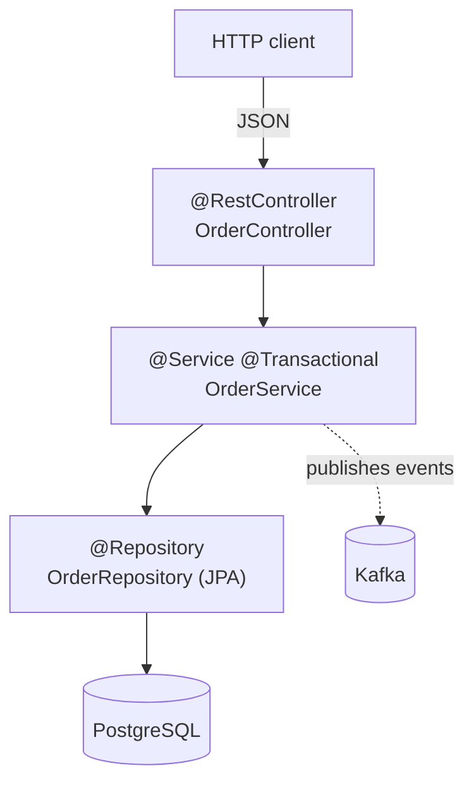
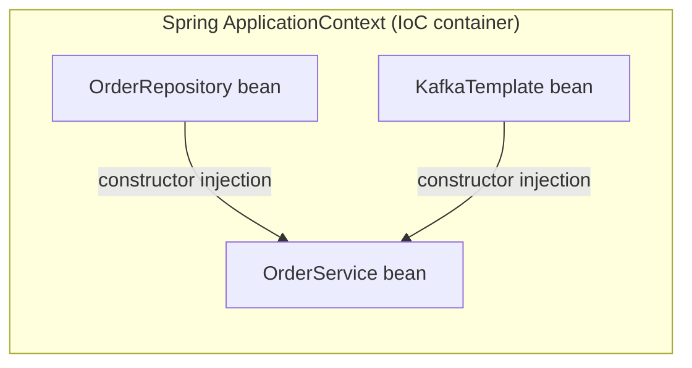
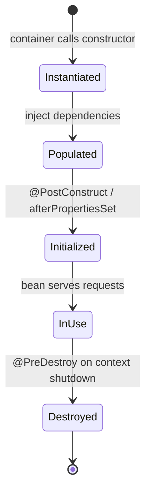
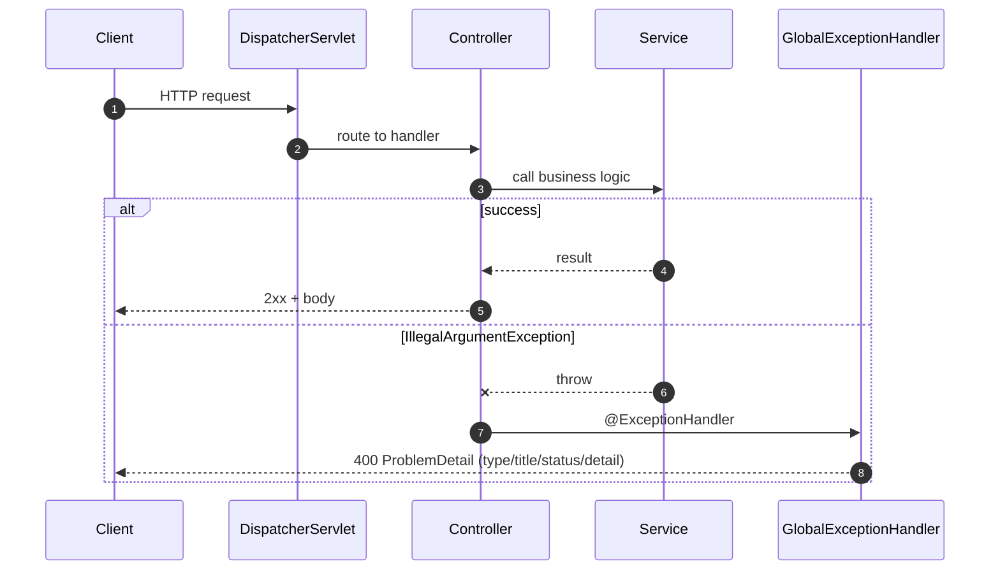
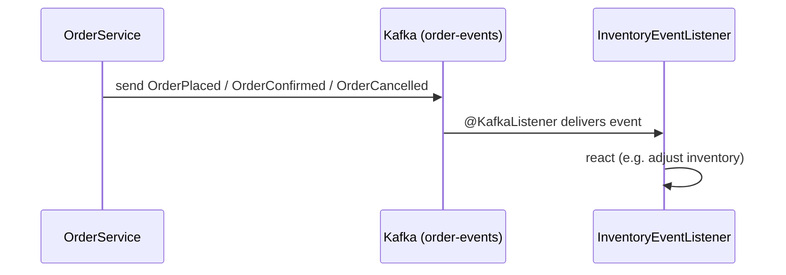

# Spring Boot Patterns

How a Spring Boot service is wired and how a request flows through it — the layered
architecture, dependency injection, bean lifecycle, and centralized error handling used by the
order service in [`integration-tests`](../integration-tests).

> Diagrams use [Mermaid](https://mermaid.js.org/) and render natively on GitHub.

---

## Layered architecture

Spring web apps separate concerns into layers, each depending only on the one below. The
controller speaks HTTP, the service holds business logic and the transaction boundary, and the
repository owns persistence. The `@Entity` is a persistence detail and ideally doesn't leak
past the service as a response type.

*Tradeoff:* layering adds indirection, but it keeps HTTP concerns out of business logic and
makes the service unit-testable without a web server.

**See it in code:** [`OrderController`](../integration-tests/src/main/java/com/denjossal/study/integration/springboot/order/OrderController.java)
→ [`OrderService`](../integration-tests/src/main/java/com/denjossal/study/integration/springboot/order/OrderService.java)
→ [`OrderRepository`](../integration-tests/src/main/java/com/denjossal/study/integration/springboot/order/OrderRepository.java)
→ [`OrderEntity`](../integration-tests/src/main/java/com/denjossal/study/integration/springboot/order/OrderEntity.java).

---

## Dependency Injection / IoC container

You declare *what* a bean needs (via constructor parameters); the **IoC container** assembles
the graph at startup and injects the collaborators. `OrderService` never news-up its
`OrderRepository` or `KafkaTemplate` — Spring hands them in. This inverts control (hence
"Inversion of Control") and makes dependencies swappable in tests.

*Why constructor injection:* dependencies are explicit, final, and the bean can't exist in a
half-wired state. **See it in code:** the `OrderService(OrderRepository, KafkaTemplate)`
constructor in [`OrderService`](../integration-tests/src/main/java/com/denjossal/study/integration/springboot/order/OrderService.java).

---

## Bean lifecycle

A managed bean isn't just `new`-ed. The container instantiates it, injects dependencies, runs
any `@PostConstruct` init, keeps it in service for the application's lifetime (singletons by
default), and runs `@PreDestroy` on shutdown.

---

## Request flow + centralized error handling

A request travels through the `DispatcherServlet` to the matched controller method. When a
handler throws, a `@RestControllerAdvice` intercepts the exception and converts it into a
consistent RFC-7807 `ProblemDetail` response — so clients always get one machine-readable
error shape instead of ad-hoc JSON.

**See it in code:** [`GlobalExceptionHandler`](../spring-boot/src/main/java/com/denjossal/study/springboot/api/GlobalExceptionHandler.java)
(RFC-7807 `ProblemDetail` for 400 / 500) and [`UserController`](../spring-boot/src/main/java/com/denjossal/study/springboot/api/UserController.java)
(resource-oriented CRUD with correct status codes).

---

## Event-driven listeners

Beyond request/response, the order service publishes lifecycle events to Kafka, and an
`@KafkaListener` consumes them asynchronously — decoupling the producer from the consumer.

**See it in code:** [`InventoryEventListener`](../integration-tests/src/main/java/com/denjossal/study/integration/springboot/inventory/InventoryEventListener.java),
driven by [`OrderService`](../integration-tests/src/main/java/com/denjossal/study/integration/springboot/order/OrderService.java).

---

## Further reading

- [Spring Framework reference — IoC container & beans](https://docs.spring.io/spring-framework/reference/core/beans.html).
- [Spring Boot reference documentation](https://docs.spring.io/spring-boot/index.html).
- [Spring guides](https://spring.io/guides) — task-focused, runnable tutorials.
- Baeldung — [constructor injection](https://www.baeldung.com/constructor-injection-in-spring), [`@ControllerAdvice` & ProblemDetail](https://www.baeldung.com/spring-boot-return-errors-problemdetail), [Spring Kafka](https://www.baeldung.com/spring-kafka).
